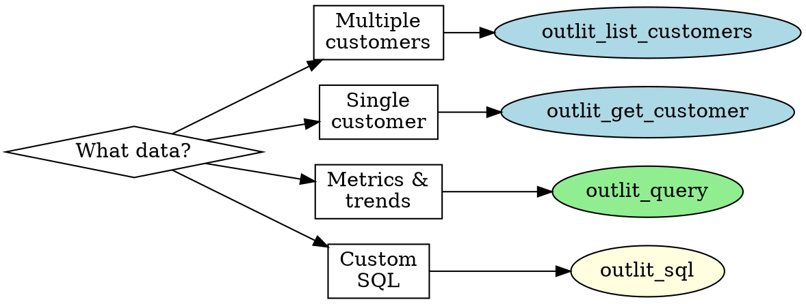

# Outlit MCP Server

Query customer intelligence data through 9 MCP tools covering customer profiles, revenue metrics, activity timelines, analytics queries, and raw SQL access.

## Quick Start



### First Call: Schema Discovery

Before writing queries, discover available data:

```json
// Discover all query types with their parameters
{ "tool": "outlit_list_query_types" }

// Discover SQL tables and columns
{ "tool": "outlit_schema" }
```

### Common Patterns

**Find at-risk customers:**

```json
{
  "tool": "outlit_list_customers",
  "billingStatus": "PAYING",
  "noActivityInLast": "30d",
  "orderBy": "currentMrr",
  "orderDirection": "desc"
}
```

**Revenue breakdown:**

```json
{
  "tool": "outlit_query",
  "queryType": "revenue_metrics",
  "params": { "metric": "mrr" },
  "groupBy": ["billingStatus"]
}
```

**Custom SQL:**

```json
{
  "tool": "outlit_sql",
  "sql": "SELECT event_type, count(*) FROM events GROUP BY 1 ORDER BY 2 DESC LIMIT 10"
}
```

---

## Tool Selection Guide

```dot
digraph tool_selection {
    rankdir=TB;
    node [shape=box fontsize=10];
    edge [fontsize=9];

    start [label="What do you need?" shape=diamond];

    // First level decisions
    list [label="Browse/filter customers"];
    single [label="Single customer deep dive"];
    aggregate [label="Aggregated metrics"];
    raw [label="Custom analytics"];
    discover [label="Explore schema"];

    // Tool outcomes
    list_customers [label="outlit_list_customers" shape=ellipse style=filled fillcolor=lightblue];
    get_customer [label="outlit_get_customer" shape=ellipse style=filled fillcolor=lightblue];
    get_timeline [label="outlit_get_timeline" shape=ellipse style=filled fillcolor=lightblue];
    get_revenue [label="outlit_get_customer_revenue" shape=ellipse style=filled fillcolor=lightblue];
    query [label="outlit_query (13 types)" shape=ellipse style=filled fillcolor=lightgreen];
    sql [label="outlit_sql" shape=ellipse style=filled fillcolor=lightyellow];
    schema [label="outlit_schema" shape=ellipse style=filled fillcolor=lightyellow];
    list_entities [label="outlit_list_entities" shape=ellipse style=filled fillcolor=lightgray];
    list_query_types [label="outlit_list_query_types" shape=ellipse style=filled fillcolor=lightgray];

    start -> list [label="segments, at-risk lists"];
    start -> single [label="specific customer"];
    start -> aggregate [label="reports, dashboards"];
    start -> raw [label="SQL, complex joins"];
    start -> discover [label="what's available?"];

    list -> list_customers;

    single -> get_customer [label="overview + contacts"];
    single -> get_timeline [label="activity history"];
    single -> get_revenue [label="billing data"];

    aggregate -> query;

    raw -> sql [label="write SQL"];
    raw -> schema [label="see columns first"];

    discover -> list_entities;
    discover -> list_query_types;
}
```



### Quick Reference

| Tool | Purpose | Key Params |
|------|---------|------------|
| `outlit_list_customers` | Filter/paginate customers | `billingStatus`, `noActivityInLast`, `mrrAbove` |
| `outlit_get_customer` | Single customer details | `customer`, `include[]`, `timeframe` |
| `outlit_get_timeline` | Activity history | `customer`, `channels[]`, `eventTypes[]` |
| `outlit_get_customer_revenue` | Revenue + attribution | `customer`, `includeAttribution` |
| `outlit_query` | Analytics (13 types) | `queryType`, `params`, `groupBy` |
| `outlit_sql` | Raw SQL queries | `sql`, `limit` |
| `outlit_schema` | SQL table schemas | `table` (optional) |
| `outlit_list_entities` | Available entities | (none) |
| `outlit_list_query_types` | Query type definitions | (none) |

---

## References

| Reference | When to Read |
|-----------|--------------|
| [Query Patterns](references/query-patterns.md) | Building `outlit_query` calls, JSON examples, all 13 query types |
| [SQL Guide](references/sql-guide.md) | Writing raw SQL, security model, available tables/columns |
| [Workflows](references/workflows.md) | Multi-step analysis: churn risk, revenue dashboards, segmentation |
| [Troubleshooting](references/troubleshooting.md) | Error codes, common issues, debugging strategies |
| [Responses](references/responses.md) | Full response examples, parsing guidance |

---

## Core Tools

### outlit_list_customers

Filter and paginate customers with risk signal indicators.

| Parameter | Type | Values | Default |
|-----------|------|--------|---------|
| `status` | enum | PROVISIONAL, ACTIVE, CHURNED, MERGED | (all) |
| `billingStatus` | enum | NONE, TRIALING, PAYING, CHURNED | (all) |
| `type` | enum | COMPANY, INDIVIDUAL | (all) |
| `hasActivityInLast` | enum | 7d, 14d, 30d, 90d | (none) |
| `noActivityInLast` | enum | 7d, 14d, 30d, 90d | (none) |
| `mrrAbove` | number | cents (e.g., 10000 = $100) | (none) |
| `mrrBelow` | number | cents | (none) |
| `search` | string | name or domain | (none) |
| `orderBy` | enum | lastActivityAt, firstSeenAt, name, currentMrr | lastActivityAt |
| `orderDirection` | enum | asc, desc | desc |
| `limit` | number | 1-100 | 20 |
| `cursor` | string | pagination token | (none) |

**Risk Signals** (returned in response): `healthy` (≤7d), `at_risk` (7-30d), `critical` (30d+)

**Example - High-value at-risk:**

```json
{
  "billingStatus": "PAYING",
  "noActivityInLast": "30d",
  "mrrAbove": 50000,
  "orderBy": "currentMrr",
  "orderDirection": "desc",
  "limit": 25
}
```

### outlit_get_customer

Get complete customer profile with optional includes.

| Parameter | Type | Description | Required |
|-----------|------|-------------|----------|
| `customer` | string | Customer ID, domain, or name | Yes |
| `include` | array | Data sections to fetch | No |
| `timeframe` | enum | 7d, 30d, 90d | No (30d) |

**Include Options:** `contacts` (journey stages), `revenue` (MRR, LTV), `recentTimeline` (activity events), `behaviorMetrics` (activity counts)

**Example - Full profile:**

```json
{
  "customer": "acme.com",
  "include": ["contacts", "revenue", "recentTimeline", "behaviorMetrics"],
  "timeframe": "30d"
}
```

### outlit_get_timeline

Get activity timeline for a customer.

| Parameter | Type | Description | Required |
|-----------|------|-------------|----------|
| `customer` | string | Customer ID or domain | Yes |
| `channels` | array | Filter by channel | No |
| `eventTypes` | array | Filter by event type | No |
| `startDate` | string | ISO 8601 timestamp | No |
| `endDate` | string | ISO 8601 timestamp | No |
| `limit` | number | 1-100 | No (50) |
| `cursor` | string | Pagination token | No |

**Channels:** `EMAIL`, `SLACK`, `INTERCOM`, `CALENDAR`, `CALL`, `DOCUMENT`

**Example - Email and meeting activity:**

```json
{
  "customer": "cust_123",
  "channels": ["EMAIL", "CALENDAR"],
  "limit": 50
}
```

### outlit_get_customer_revenue

Get revenue metrics and attribution for a customer.

| Parameter | Type | Description | Required |
|-----------|------|-------------|----------|
| `customer` | string | Customer ID or domain | Yes |
| `timeframe` | enum | 30d, 90d, 12m, all | No (12m) |
| `includeAttribution` | boolean | Include UTM/channel data | No (true) |
| `includeBillingHistory` | boolean | Include billing events | No (true) |

**Example:**

```json
{
  "customer": "acme.com",
  "includeAttribution": true,
  "includeBillingHistory": true
}
```

---

## Analytics: outlit_query

Execute analytics queries across 13 query types with flexible filtering and grouping.

All query types accept: `queryType` (required), `timeframe` (7d/14d/30d/90d/1y/all, default 30d), `params`, `groupBy`, `limit` (1-1000), and `cursor`. See [Query Patterns](references/query-patterns.md) for full parameter documentation.

### Query Types

| Type | Data Source | Purpose | Key Params |
|------|-------------|---------|------------|
| `customer_cohort` | Prisma | Find customers by filters | `filters`, `include` |
| `customer_metrics` | Prisma | Count customers by segment | `metric` |
| `contact_journey` | Prisma | Journey stage analysis | `metric`, `stages` |
| `revenue_metrics` | Prisma | MRR, LTV, ARPU, churn | `metric`, `segmentBy` |
| `revenue_attribution` | Prisma | Revenue by channel | `metric` |
| `revenue_trends` | Prisma | Revenue over time | `granularity`, `metric` |
| `event_aggregates` | ClickHouse | Event counts | `eventTypes`, `channels` |
| `event_trends` | ClickHouse | Event time series | `granularity`, `channels` |
| `feature_usage` | ClickHouse | Feature adoption | `features`, `metric` |
| `session_metrics` | ClickHouse | Sessions, pageviews | `metric` |
| `communication_summary` | ClickHouse | Email, call, slack activity | `channels`, `metric` |
| `company_insights` | AI | Company analysis | `customerId`, `includeBlocks` |
| `contact_insights` | AI | Contact analysis | `customerId`, `includeBlocks` |

> **Note:** ClickHouse queries return 503 if the analytics service is unavailable. Handle this gracefully.

See [Query Patterns](references/query-patterns.md) for detailed examples of each query type.

---

## Raw SQL: outlit_sql

Execute custom SQL queries against analytics data with built-in security.

### Parameters

| Parameter | Type | Description | Required |
|-----------|------|-------------|----------|
| `sql` | string | SQL SELECT query | Yes |
| `limit` | number | Max rows (1-10000) | No (1000) |

**Available tables:** `events`, `customer_dimensions`, `user_dimensions`, `mrr_snapshots`

Use `outlit_schema` to discover columns before writing queries.

**Security:** Only SELECT queries allowed. Organization data isolated via row policies. External access functions blocked.

See [SQL Guide](references/sql-guide.md) for complete table schemas, security model, and error handling.

---

## Schema Discovery

### outlit_schema

Get table schemas for SQL queries.

```json
// All tables
{ "tool": "outlit_schema" }

// Specific table with columns
{ "tool": "outlit_schema", "table": "events" }
```

**Response includes:** Column names, types, descriptions, and example queries.

### outlit_list_entities

List all queryable data entities.

```json
{ "tool": "outlit_list_entities" }
```

### outlit_list_query_types

Get all `outlit_query` types with parameter schemas.

```json
{ "tool": "outlit_list_query_types" }
```

**Use this to discover:** Valid `queryType` values, available `groupBy` fields per type, and parameter options/defaults.

---

## Data Model

### Customer States

**`status`:** PROVISIONAL (new), ACTIVE (active customer), CHURNED (no longer active), MERGED (combined with another)

**`billingStatus`:** NONE (no billing), TRIALING (trial period), PAYING (active subscription), CHURNED (cancelled)

### Contact Journey Stages

```text
DISCOVERED → SIGNED_UP → ACTIVATED → ENGAGED → INACTIVE
```

### Data Formats

- **Monetary values:** Cents (100 = $1.00)
- **Timestamps:** ISO 8601 (`2025-01-15T10:30:00Z`)
- **IDs:** String prefixes (`cust_`, `contact_`, `evt_`)

---

## Pagination

All list endpoints use cursor-based pagination:

```json
// First request
{ "tool": "outlit_list_customers", "limit": 25 }

// Response
{
  "items": [...],
  "pagination": {
    "hasMore": true,
    "nextCursor": "eyJsYXN0QWN0aXZpdHlBdCI6Li4ufQ==",
    "total": 156
  }
}

// Next page
{ "tool": "outlit_list_customers", "limit": 25, "cursor": "eyJsYXN0QWN0aXZpdHlBdCI6Li4ufQ==" }
```

**Always check `pagination.hasMore` before requesting more pages.**

---

## Best Practices

1. **Start with schema discovery** — Call `outlit_list_query_types` or `outlit_schema` first
2. **Use filters at the source** — Filter in the query, not after fetching
3. **Request only needed includes** — Omit `include` options you don't need
4. **Prefer query tool for aggregations** — Don't loop over customers for metrics
5. **Handle ClickHouse unavailability** — Event/session queries may return 503
6. **Convert cents to dollars** — Divide monetary values by 100 for display
7. **Use SQL for custom analytics** — When predefined queries don't fit

## Known Limitations

1. **No cross-query filtering**: Cannot filter `feature_usage` by customer cohort in one query
2. **Feature names not enumerated**: Use `outlit_list_query_types` to discover features
3. **ClickHouse availability**: `event_*`, `feature_usage`, `session_metrics` return 503 if unavailable
4. **MRR filtering is post-fetch**: May be slower on large datasets
5. **Timeline requires customer**: Cannot query timeline across all customers
6. **SQL is read-only**: No INSERT, UPDATE, DELETE operations

---

## Troubleshooting

See [Troubleshooting Guide](references/troubleshooting.md) for detailed solutions.

**Quick fixes:**

| Issue | Solution |
|-------|----------|
| 401 Unauthorized | Check authentication, re-authorize MCP connection |
| 404 Not Found | Verify customer ID/domain exists |
| 503 Service Unavailable | ClickHouse offline, use Prisma-based queries |
| Empty results | Widen filters, check timeframe |
| Slow queries | Add filters, reduce limit, avoid `all` timeframe |
| SQL table not found | Use `outlit_schema` to see available tables |
