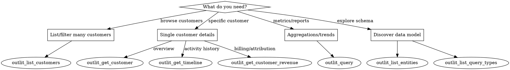

# Outlit MCP Server

Complete reference for the Outlit MCP tools that provide customer intelligence, revenue analytics, and activity timeline data.

## Tool Selection



## Quick Reference

| Tool | Purpose | When to Use |
|------|---------|-------------|
| `outlit_list_customers` | Filter and paginate customers | Finding customer segments, at-risk lists |
| `outlit_get_customer` | Single customer with includes | Deep dive on one customer |
| `outlit_get_timeline` | Activity history | Understanding engagement patterns |
| `outlit_get_customer_revenue` | Revenue + attribution | Billing analysis, acquisition source |
| `outlit_query` | Analytics queries (13 types) | Aggregations, trends, cohorts |
| `outlit_list_entities` | Available data entities | Schema discovery |
| `outlit_list_query_types` | Query type definitions | Understanding query params |

## Core Tools

### outlit_list_customers

Find customers matching criteria with pagination.

**Key Parameters:**

| Parameter | Values | Purpose |
|-----------|--------|---------|
| `status` | PROVISIONAL, ACTIVE, CHURNED, MERGED | Lifecycle stage |
| `billingStatus` | NONE, TRIALING, PAYING, CHURNED | Payment state |
| `type` | COMPANY, INDIVIDUAL | Customer type |
| `hasActivityInLast` | 7d, 14d, 30d, 90d | Active customers |
| `noActivityInLast` | 7d, 14d, 30d, 90d | Inactive/at-risk |
| `mrrAbove` / `mrrBelow` | number (cents) | Revenue thresholds |
| `search` | string | Name/domain search |
| `orderBy` | lastActivityAt, firstSeenAt, name, currentMrr | Sort field |
| `limit` | 1-100 | Page size |
| `cursor` | string | Pagination token |

**Response includes:**
- `id`, `name`, `domain` - Customer identity
- `status`, `billingStatus`, `type` - Classification
- `currentMrr`, `contactCount` - Metrics
- `daysSinceActivity`, `riskSignal` - Health indicators
- `pagination.nextCursor` - For next page

**Risk Signals:**
- `healthy`: Activity within 7 days
- `at_risk`: Activity 7-30 days ago
- `critical`: No activity in 30+ days

### outlit_get_customer

Get detailed customer info with optional includes.

**Parameters:**

| Parameter | Type | Description |
|-----------|------|-------------|
| `customer` | string | Customer ID, domain, or name |
| `include` | array | `contacts`, `revenue`, `recentTimeline`, `behaviorMetrics` |
| `timeframe` | enum | 7d, 30d, 90d (default: 30d) |

**Include options:**
- `contacts` - List of associated contacts with journey stages
- `revenue` - MRR, lifetime revenue, subscription count
- `recentTimeline` - Recent activities (limited)
- `behaviorMetrics` - Activity count, active contacts, last email/meeting

### outlit_get_timeline

Get activity history for a customer.

**Parameters:**

| Parameter | Type | Description |
|-----------|------|-------------|
| `customer` | string | Customer ID or domain |
| `channels` | array | EMAIL, SLACK, INTERCOM, CALENDAR, CALL, DOCUMENT |
| `eventTypes` | array | Filter by event type |
| `timeframe` | enum | 7d, 14d, 30d, 90d, all |
| `limit` | number | 1-100 (default: 50) |
| `cursor` | string | Pagination token |

**Common Event Types:**
- EMAIL_SENT, EMAIL_RECEIVED
- MEETING_COMPLETED, MEETING_SCHEDULED
- CALL_COMPLETED
- SLACK_MESSAGE
- DOCUMENT_VIEWED

### outlit_get_customer_revenue

Get revenue metrics and attribution.

**Parameters:**

| Parameter | Type | Description |
|-----------|------|-------------|
| `customer` | string | Customer ID or domain |
| `timeframe` | enum | 30d, 90d, 12m, all |
| `includeAttribution` | boolean | Include UTM/channel data |
| `includeBillingHistory` | boolean | Include billing events |

**Returns:**
- `revenue.currentMrr` - Monthly recurring revenue (cents)
- `revenue.lifetimeRevenue` - Total revenue (cents)
- `attribution.channel` - Acquisition source
- `attribution.utmSource/Medium/Campaign` - UTM parameters
- `recentBillingEvents` - Payment/invoice history

## Analytics with outlit_query

The `outlit_query` tool supports 13 query types for analytics.

### Query Types Reference

| Type | Data Source | Purpose |
|------|-------------|---------|
| `customer_cohort` | Prisma | Find customers by filters |
| `customer_metrics` | Prisma | Count customers by grouping |
| `contact_journey` | Prisma | Journey stage analysis |
| `revenue_metrics` | Prisma | MRR, LTV, ARPU, churn |
| `revenue_attribution` | Prisma | Revenue by channel |
| `revenue_trends` | Prisma | Revenue over time |
| `event_aggregates` | ClickHouse | Event counts |
| `event_trends` | ClickHouse | Event time series |
| `feature_usage` | ClickHouse | Feature adoption |
| `session_metrics` | ClickHouse | Sessions, pageviews |
| `communication_summary` | ClickHouse | Email, call, slack activity |
| `company_insights` | AI | Company analysis |
| `contact_insights` | AI | Contact analysis |

### Common Query Patterns

**Find at-risk paying customers:**
```json
{
  "queryType": "customer_cohort",
  "timeframe": "90d",
  "params": {
    "filters": {
      "billingStatus": ["PAYING"],
      "noActivityInLast": "30d"
    },
    "include": ["revenue", "contacts"]
  }
}
```

**Revenue breakdown by status:**
```json
{
  "queryType": "revenue_metrics",
  "timeframe": "30d",
  "params": { "metric": "mrr" },
  "groupBy": ["billingStatus"]
}
```

**Event volume by channel:**
```json
{
  "queryType": "event_aggregates",
  "timeframe": "30d",
  "params": { "channels": ["EMAIL", "SLACK", "CALENDAR"] },
  "groupBy": ["channel"]
}
```

**Feature adoption rates:**
```json
{
  "queryType": "feature_usage",
  "timeframe": "90d",
  "params": {
    "features": ["dashboard_view", "export_pdf"],
    "metric": "adoption"
  }
}
```

**Revenue trends over time:**
```json
{
  "queryType": "revenue_trends",
  "timeframe": "1y",
  "params": {
    "granularity": "month",
    "metric": "mrr"
  }
}
```

### Query Parameters

**Global (all query types):**
- `timeframe`: 7d, 14d, 30d, 90d, 1y, all
- `limit`: 1-1000 (default: 100)
- `groupBy`: Dimension fields (varies by type)
- `cursor`: Pagination token

**customer_cohort params:**
- `filters.status[]` - PROVISIONAL, ACTIVE, CHURNED, MERGED
- `filters.billingStatus[]` - NONE, TRIALING, PAYING, CHURNED
- `filters.type[]` - COMPANY, INDIVIDUAL
- `filters.hasActivityInLast` - 7d, 14d, 30d, 90d
- `filters.noActivityInLast` - 7d, 14d, 30d, 90d
- `filters.mrrAbove/mrrBelow` - Revenue thresholds
- `include[]` - revenue, contacts
- `orderBy`, `orderDirection`

**revenue_metrics params:**
- `metric`: mrr, ltv, arpu, churn_rate

**event_aggregates/event_trends params:**
- `eventTypes[]` - Filter event types
- `channels[]` - Filter channels
- `granularity` - hour, day, week, month (trends only)

**feature_usage params:**
- `features[]` - Feature names to analyze
- `metric`: adoption, frequency, retention, dau, mau

**session_metrics params:**
- `metric`: sessions, pageviews, bounce_rate, avg_session_duration

**communication_summary params:**
- `channels[]` - email, slack, call, meeting
- `metric`: volume, response_time, participants

## Common Workflows

### Churn Risk Analysis

1. **Find at-risk customers:**
```
outlit_list_customers(
  billingStatus: "PAYING",
  noActivityInLast: "30d",
  orderBy: "currentMrr",
  orderDirection: "desc"
)
```

2. **For each high-value at-risk customer, get context:**
```
outlit_get_customer(
  customer: <id>,
  include: ["contacts", "revenue", "behaviorMetrics"]
)
```

3. **Check their activity pattern:**
```
outlit_get_timeline(
  customer: <id>,
  timeframe: "90d"
)
```

### Revenue Dashboard

1. **Total MRR by billing status:**
```
outlit_query(queryType: "revenue_metrics", params: {metric: "mrr"}, groupBy: ["billingStatus"])
```

2. **Revenue trend:**
```
outlit_query(queryType: "revenue_trends", params: {granularity: "month", metric: "mrr"}, timeframe: "1y")
```

3. **Attribution breakdown:**
```
outlit_query(queryType: "revenue_attribution")
```

### Customer Segmentation

1. **High-value active customers:**
```
outlit_list_customers(
  billingStatus: "PAYING",
  hasActivityInLast: "7d",
  mrrAbove: 10000,
  orderBy: "currentMrr"
)
```

2. **Trial customers ready to convert:**
```
outlit_list_customers(
  billingStatus: "TRIALING",
  hasActivityInLast: "7d"
)
```

3. **Customer distribution:**
```
outlit_query(queryType: "customer_metrics", groupBy: ["billingStatus", "type"])
```

## Data Model

### Customer States

**Status (lifecycle):**
- `PROVISIONAL` - New, unvalidated
- `ACTIVE` - Engaged customer
- `CHURNED` - Former customer
- `MERGED` - Consolidated into another

**Billing Status:**
- `NONE` - No billing relationship
- `TRIALING` - Free trial period
- `PAYING` - Active subscription
- `CHURNED` - Cancelled subscription

### Contact Journey Stages

- `DISCOVERED` - Initial contact
- `SIGNED_UP` - Account created
- `ACTIVATED` - Key milestone reached
- `ENGAGED` - Regular usage
- `INACTIVE` - Lapsed engagement

### Currency

All monetary values (MRR, LTV, amounts) are in **cents** (100 = $1.00).

### Timestamps

All dates are ISO 8601 format (e.g., `2025-01-15T10:30:00Z`).

## Pagination

All list endpoints use cursor-based pagination:

1. First request: omit `cursor`
2. Check `pagination.hasMore` in response
3. If true, use `pagination.nextCursor` for next request
4. Repeat until `hasMore: false`

**Example:**
```
// Page 1
outlit_list_customers(limit: 20)
// Response: { items: [...], pagination: { hasMore: true, nextCursor: "abc123" } }

// Page 2
outlit_list_customers(limit: 20, cursor: "abc123")
```

## Error Handling

| Status | Meaning |
|--------|---------|
| 401 | Authentication required or invalid |
| 400 | Invalid parameters |
| 404 | Customer/entity not found |
| 503 | ClickHouse unavailable (analytics queries) |

## Schema Discovery Tools

Use these tools first when exploring unfamiliar data.

### outlit_list_entities

Returns all queryable data entities with their operations.

**No parameters required.**

**Response:**
```json
{
  "entities": [
    { "name": "customer", "description": "...", "operations": ["list", "get"] },
    { "name": "contact", "description": "...", "operations": ["list", "get"] },
    { "name": "event", "description": "...", "operations": ["query"] }
  ]
}
```

### outlit_list_query_types

Returns all `outlit_query` types with parameter schemas.

**No parameters required.**

**Response:**
```json
{
  "queryTypes": [
    {
      "name": "customer_cohort",
      "description": "Find customers matching specified filters",
      "dataSource": "prisma",
      "params": { "filters": {...}, "include": [...] },
      "groupBy": ["status", "billingStatus", "type"]
    }
  ],
  "timeframes": ["7d", "14d", "30d", "90d", "1y", "all"]
}
```

**Use this to discover:** Available features for `feature_usage`, valid `groupBy` fields, parameter schemas.

## Example Responses

### outlit_list_customers response
```json
{
  "items": [
    {
      "id": "cust_abc123",
      "name": "Acme Corp",
      "domain": "acme.com",
      "type": "COMPANY",
      "status": "ACTIVE",
      "billingStatus": "PAYING",
      "firstSeenAt": "2024-06-15T10:30:00Z",
      "lastActivityAt": "2025-01-28T14:22:00Z",
      "contactCount": 5,
      "currentMrr": 500000,
      "daysSinceActivity": 3,
      "riskSignal": "healthy"
    }
  ],
  "pagination": {
    "hasMore": true,
    "nextCursor": "eyJsYXN0QWN0aXZpdHlBdCI6...",
    "total": 156
  }
}
```

### outlit_get_customer response (with all includes)
```json
{
  "customer": {
    "id": "cust_abc123",
    "name": "Acme Corp",
    "domain": "acme.com",
    "type": "COMPANY",
    "status": "ACTIVE",
    "billingStatus": "PAYING",
    "firstSeenAt": "2024-06-15T10:30:00Z",
    "lastActivityAt": "2025-01-28T14:22:00Z",
    "owner": "sales@mycompany.com"
  },
  "contacts": [
    {
      "id": "contact_xyz",
      "email": "john@acme.com",
      "name": "John Smith",
      "role": "VP Engineering",
      "journeyStage": "ENGAGED",
      "lastActivityAt": "2025-01-28T14:22:00Z"
    }
  ],
  "revenue": {
    "currentMrr": 500000,
    "lifetimeRevenue": 3500000,
    "activeSubscriptions": 2
  },
  "behaviorMetrics": {
    "activityCount": 47,
    "activeContacts": 3,
    "lastEmailAt": "2025-01-27T09:15:00Z",
    "lastMeetingAt": "2025-01-20T15:00:00Z"
  }
}
```

### outlit_query response (revenue_metrics)
```json
{
  "queryType": "revenue_metrics",
  "timeframe": "30d",
  "executedAt": "2025-01-30T10:00:00Z",
  "results": {
    "data": [
      { "billingStatus": "PAYING", "mrr": 12500000, "customerCount": 45 },
      { "billingStatus": "TRIALING", "mrr": 0, "customerCount": 12 },
      { "billingStatus": "CHURNED", "mrr": 0, "customerCount": 8 }
    ]
  },
  "metadata": {
    "rowCount": 3,
    "queryDurationMs": 145,
    "dataSource": "prisma"
  }
}
```

### Empty results
When no data matches, responses return empty arrays:
```json
{
  "items": [],
  "pagination": { "hasMore": false, "nextCursor": null, "total": 0 }
}
```

## Known Limitations

1. **No cross-query filtering**: Cannot filter `feature_usage` by customer cohort in one query. Workaround: Get customer IDs first, then query features separately.

2. **Feature names not enumerated**: Use `outlit_list_query_types` or run `feature_usage` without `features` param to discover available features.

3. **Analytics queries require ClickHouse**: `event_*`, `feature_usage`, `session_metrics`, `communication_summary` return 503 if ClickHouse is disabled.

4. **MRR filtering is post-fetch**: `mrrAbove`/`mrrBelow` may be slower on large datasets.

5. **Timeline requires customer**: Cannot query timeline across all customers - must specify one.

## Best Practices

1. **Start with schema discovery**: Call `outlit_list_query_types` to understand available options
2. **Use includes wisely**: Request only needed data to reduce payload
3. **Prefer query tool for aggregations**: Don't loop over customers for metrics
4. **Filter at the source**: Use parameters vs client-side filtering
5. **Handle pagination**: Large datasets require cursor iteration
6. **Check data source**: ClickHouse queries (event_*) may have latency
7. **Convert cents to dollars**: Divide monetary values by 100 for display
