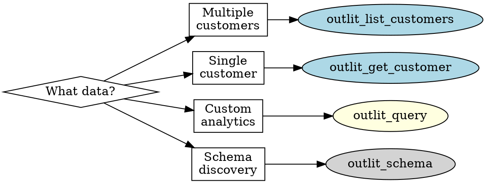
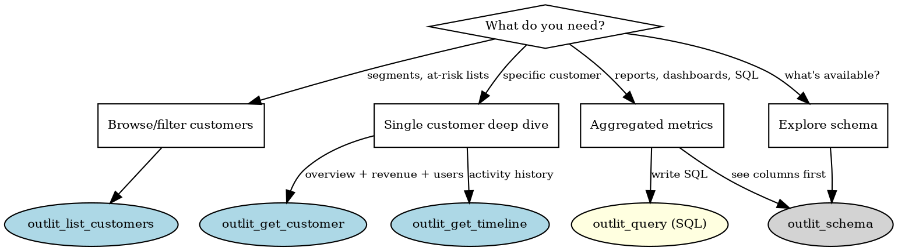

# Outlit MCP Server

Query customer intelligence data through 6 MCP tools covering customer and user profiles, revenue metrics, activity timelines, and raw SQL analytics access.

## Quick Start



### First Call: Schema Discovery

Before writing SQL queries, discover available tables and columns:

```json
// Discover SQL tables and columns
{ "tool": "outlit_schema" }
```

### Common Patterns

**Find at-risk customers:**

```json
{
  "tool": "outlit_list_customers",
  "billingStatus": "PAYING",
  "noActivityInLast": "30d",
  "orderBy": "mrr_cents",
  "orderDirection": "desc"
}
```

**Revenue breakdown (SQL):**

```json
{
  "tool": "outlit_query",
  "sql": "SELECT billing_status, count(*) as customers, sum(mrr_cents)/100 as mrr_dollars FROM customer_dimensions GROUP BY 1 ORDER BY 3 DESC"
}
```

**Event analytics (SQL):**

```json
{
  "tool": "outlit_query",
  "sql": "SELECT event_type, count(*) FROM events WHERE occurred_at >= now() - INTERVAL 30 DAY GROUP BY 1 ORDER BY 2 DESC LIMIT 10"
}
```

---

## MCP Setup

### Get an API Key

Go to **Settings > MCP Integration** in the Outlit dashboard ([app.outlit.ai](https://app.outlit.ai)).

### Server URLs

| Environment | URL |
|-------------|-----|
| Production | `https://mcp.outlit.ai` |
| Staging | `https://staging.mcp.outlit.ai` |
| Local dev | `http://localhost:3001` |

### Claude Code

```bash
claude mcp add outlit-mcp https://mcp.outlit.ai/sse -- --header "Authorization: Bearer YOUR_API_KEY"
```

### Claude Desktop

Add to `claude_desktop_config.json`:

```json
{
  "mcpServers": {
    "outlit-mcp": {
      "url": "https://mcp.outlit.ai/sse",
      "headers": {
        "Authorization": "Bearer YOUR_API_KEY"
      }
    }
  }
}
```

### Cursor

Add to `.cursor/mcp.json`:

```json
{
  "mcpServers": {
    "outlit-mcp": {
      "url": "https://mcp.outlit.ai/sse",
      "headers": {
        "Authorization": "Bearer YOUR_API_KEY"
      }
    }
  }
}
```

### Verify Connection

Call `outlit_schema` to confirm the connection is working:

```json
{ "tool": "outlit_schema" }
```

---

## Tool Selection Guide



### Quick Reference

| Tool | Purpose | Key Params |
|------|---------|------------|
| `outlit_list_customers` | Filter/paginate customers | `billingStatus`, `noActivityInLast`, `mrrAbove` |
| `outlit_list_users` | Filter/paginate users | `journeyStage`, `customerId`, `noActivityInLast` |
| `outlit_get_customer` | Single customer details | `customer`, `include[]`, `timeframe` |
| `outlit_get_timeline` | Activity history | `customer`, `channels[]`, `eventTypes[]` |
| `outlit_query` | Raw SQL queries | `sql`, `limit` |
| `outlit_schema` | SQL table schemas | `table` (optional) |

---

## References

| Reference | When to Read |
|-----------|--------------|
| [Query Patterns](references/query-patterns.md) | SQL examples for common analytics: MRR, cohorts, events, churn |
| [SQL Guide](references/sql-guide.md) | Complete table schemas, security model, ClickHouse tips |
| [Workflows](references/workflows.md) | Multi-step analysis: churn risk, revenue dashboards, segmentation |
| [Troubleshooting](references/troubleshooting.md) | Error codes, common issues, debugging strategies |
| [Responses](references/responses.md) | Full response examples, parsing guidance |

---

## Core Tools

### outlit_list_customers

Filter and paginate customers with activity and billing filters.

| Parameter | Type | Values | Default |
|-----------|------|--------|---------|
| `billingStatus` | enum | NONE, TRIALING, PAYING, CHURNED | (all) |
| `hasActivityInLast` | enum | 7d, 14d, 30d, 90d | (none) |
| `noActivityInLast` | enum | 7d, 14d, 30d, 90d | (none) |
| `mrrAbove` | number | cents (e.g., 10000 = $100) | (none) |
| `mrrBelow` | number | cents | (none) |
| `search` | string | name or domain | (none) |
| `orderBy` | enum | last_activity_at, first_seen_at, name, mrr_cents | last_activity_at |
| `orderDirection` | enum | asc, desc | desc |
| `limit` | number | 1-1000 | 20 |
| `cursor` | string | pagination token | (none) |

**Example - High-value inactive customers:**

```json
{
  "billingStatus": "PAYING",
  "noActivityInLast": "30d",
  "mrrAbove": 50000,
  "orderBy": "mrr_cents",
  "orderDirection": "desc",
  "limit": 25
}
```

### outlit_list_users

Filter and paginate users with journey stage and activity filters.

| Parameter | Type | Values | Default |
|-----------|------|--------|---------|
| `journeyStage` | enum | DISCOVERED, SIGNED_UP, ACTIVATED, ENGAGED, INACTIVE | (all) |
| `customerId` | string | Filter by customer ID | (none) |
| `hasActivityInLast` | string | Nd, Nh, or Nm (e.g., 7d, 24h, 90m) | (none) |
| `noActivityInLast` | string | Nd, Nh, or Nm (e.g., 30d, 2h) | (none) |
| `search` | string | email or name | (none) |
| `orderBy` | enum | last_activity_at, first_seen_at, email | last_activity_at |
| `orderDirection` | enum | asc, desc | desc |
| `limit` | number | 1-1000 | 20 |
| `cursor` | string | pagination token | (none) |

**Example - Inactive engaged users:**

```json
{
  "journeyStage": "ENGAGED",
  "noActivityInLast": "30d",
  "orderBy": "last_activity_at",
  "orderDirection": "desc",
  "limit": 50
}
```

### outlit_get_customer

Get complete customer profile with optional includes.

| Parameter | Type | Description | Required |
|-----------|------|-------------|----------|
| `customer` | string | Customer ID, domain, or name | Yes |
| `include` | array | Data sections to fetch | No |
| `timeframe` | enum | 7d, 14d, 30d, 90d | No (30d) |

**Include Options:** `users` (journey stages), `revenue` (MRR, LTV), `recentTimeline` (activity events), `behaviorMetrics` (activity counts)

**Example - Full profile:**

```json
{
  "customer": "acme.com",
  "include": ["users", "revenue", "recentTimeline", "behaviorMetrics"],
  "timeframe": "30d"
}
```

### outlit_get_timeline

Get activity timeline for a customer.

| Parameter | Type | Description | Required |
|-----------|------|-------------|----------|
| `customer` | string | Customer ID or domain | Yes |
| `channels` | array | Filter by channel | No |
| `eventTypes` | array | Filter by event type | No |
| `timeframe` | enum | 7d, 14d, 30d, 90d, all (default: 30d) | No |
| `startDate` | string | ISO 8601 start (mutually exclusive with timeframe) | No |
| `endDate` | string | ISO 8601 end (mutually exclusive with timeframe) | No |
| `limit` | number | 1-1000 | No (50) |
| `cursor` | string | Pagination token | No |

**Channels:** `SDK`, `EMAIL`, `SLACK`, `CALL`, `CRM`, `BILLING`, `SUPPORT`, `INTERNAL`

**Example - Recent email and call activity:**

```json
{
  "customer": "acme.com",
  "channels": ["EMAIL", "CALL"],
  "timeframe": "30d",
  "limit": 50
}
```

**Example - Activity in a specific date range:**

```json
{
  "customer": "acme.com",
  "startDate": "2025-01-01T00:00:00Z",
  "endDate": "2025-01-31T23:59:59Z"
}
```

---

## Raw SQL: outlit_query

Execute custom SQL queries against analytics data with built-in security.

### Parameters

| Parameter | Type | Description | Required |
|-----------|------|-------------|----------|
| `sql` | string | SQL SELECT query | Yes |
| `limit` | number | Max rows (1-10000) | No (1000) |

**Available tables:** `events`, `customer_dimensions`, `user_dimensions`, `mrr_snapshots`

Use `outlit_schema` to discover columns before writing queries.

**Security:** Only SELECT queries allowed. Organization data isolated via row policies. External access functions blocked.

### Quick SQL Examples

**MRR by billing status:**
```json
{
  "tool": "outlit_query",
  "sql": "SELECT billing_status, count(*) as customers, sum(mrr_cents)/100 as mrr FROM customer_dimensions GROUP BY 1"
}
```

**Daily event volume:**
```json
{
  "tool": "outlit_query",
  "sql": "SELECT toDate(occurred_at) as day, count(*) as events FROM events WHERE occurred_at >= now() - INTERVAL 30 DAY GROUP BY 1 ORDER BY 1"
}
```

**Top customers by activity:**
```json
{
  "tool": "outlit_query",
  "sql": "SELECT customer_id, customer_domain, count(*) as events FROM events WHERE occurred_at >= now() - INTERVAL 30 DAY GROUP BY 1, 2 ORDER BY 3 DESC LIMIT 25"
}
```

See [Query Patterns](references/query-patterns.md) for comprehensive SQL examples covering all common analytics use cases.

See [SQL Guide](references/sql-guide.md) for complete table schemas, security model, and error handling.

---

## Schema Discovery

### outlit_schema

Get table schemas for SQL queries.

```json
// All tables
{ "tool": "outlit_schema" }

// Specific table with columns
{ "tool": "outlit_schema", "table": "events" }
```

**Response includes:** Column names, types, descriptions, and example queries.

---

## Data Model

### Customer States

**`billingStatus`:** NONE (no billing), TRIALING (trial period), PAYING (active subscription), CHURNED (cancelled)

### Contact Journey Stages

```text
DISCOVERED → SIGNED_UP → ACTIVATED → ENGAGED → INACTIVE
```

### Data Formats

- **Monetary values:** Cents (100 = $1.00)
- **Timestamps:** ISO 8601 (`2025-01-15T10:30:00Z`)
- **IDs:** String prefixes (`cust_`, `contact_`, `evt_`)

---

## Pagination

All list endpoints use cursor-based pagination:

```json
// First request
{ "tool": "outlit_list_customers", "limit": 25 }

// Response
{
  "items": [...],
  "pagination": {
    "hasMore": true,
    "nextCursor": "eyJsYXN0QWN0aXZpdHlBdCI6Li4ufQ==",
    "total": 156
  }
}

// Next page
{ "tool": "outlit_list_customers", "limit": 25, "cursor": "eyJsYXN0QWN0aXZpdHlBdCI6Li4ufQ==" }
```

**Always check `pagination.hasMore` before requesting more pages.**

---

## Best Practices

1. **Start with schema discovery** — Call `outlit_schema` before writing SQL
2. **Use filters at the source** — Filter in the query, not after fetching
3. **Request only needed includes** — Omit `include` options you don't need
4. **Prefer customer tools for single lookups** — Don't use SQL for single customer queries
5. **Add time filters to SQL** — Always include `WHERE occurred_at >= ...` for event queries
6. **Convert cents to dollars** — Divide monetary values by 100 for display
7. **Use LIMIT in SQL** — Cap result sets to avoid large data transfers

## Known Limitations

1. **SQL is read-only**: No INSERT, UPDATE, DELETE operations
2. **Organization isolation**: Cannot query data from other organizations
3. **Timeline requires customer**: Cannot query timeline across all customers
4. **MRR filtering is post-fetch**: May be slower on large datasets in list_customers
5. **Event queries require time filters**: Queries without date ranges scan all data

---

## Troubleshooting

See [Troubleshooting Guide](references/troubleshooting.md) for detailed solutions.

**Quick fixes:**

| Issue | Solution |
|-------|----------|
| 401 Unauthorized | Check authentication, re-authorize MCP connection |
| 404 Not Found | Verify customer ID/domain exists |
| Empty results | Widen filters, check timeframe |
| Slow queries | Add filters, reduce limit, add time constraints |
| SQL table not found | Use `outlit_schema` to see available tables |
| SQL syntax error | Check ClickHouse syntax (not MySQL/PostgreSQL) |
